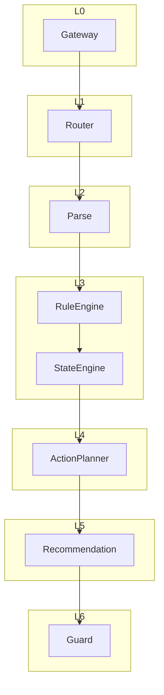
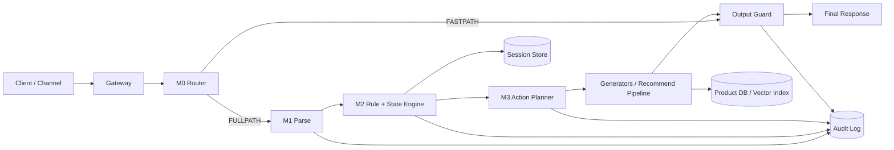
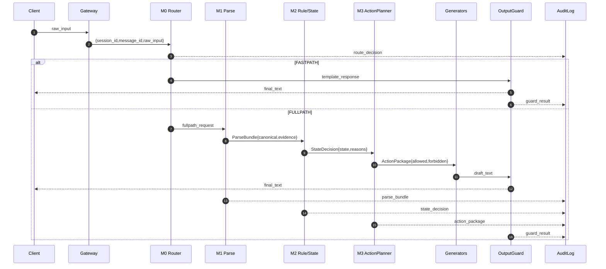
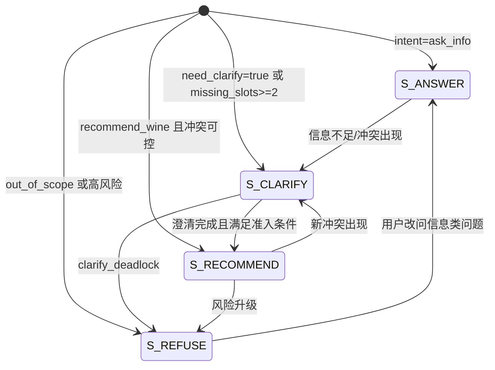

# 系统说明书.md

---

## 文档拆分说明（无损）

- 原始主文档 `00_系统说明书.md` 保留不删，作为历史归档与全文检索入口。
- 后续增量需求优先写入分卷目录：`./spec/`。
- 分卷索引与路由规则见：`./spec/00_index.md`。
- 变更流程约定：先提交改动清单，待你确认后再执行。

---




# 1. 系统设计哲学与目标

> 【来源：SPEC_v3 第1章 + 第2章】

本章解决“系统为什么存在、必须遵守什么边界”的问题。
它位于整个系统说明书的最顶层，是后续所有架构层设计、规则控制与生成限制的最高约束来源。
所有层级展开均不得违反本章所定义的目标与边界。

---

## 1.1 文档目的与适用范围

> 【来源：SPEC_v3 第1.1节】

本节说明本规格书的工程定位，明确其为唯一实现依据。
它与后续各层接口定义直接相关，是所有模块验收的标准来源。

本规格书用于将既有材料整理为可执行的工程规格，覆盖系统目标、范围、模块、数据结构、状态机、规则引擎、日志审计、错误处理与测试验收标准。

**验收标准/完成定义**：

* 本文档可作为工程实现与验收的唯一规格入口。
* 所有章节均包含可执行的接口描述与验收标准。

---

## 1.2 文档约定

> 【来源：SPEC_v3 第1.2节】

本节解决规格约束一致性问题，防止未定义字段进入系统。

* 若出现未在现有材料中明示的内容，必须标注 `TODO:`。
* 所有规则描述必须包含输入/输出字段。

**验收标准/完成定义**：

* 全文不存在未标注来源的新功能或新增字段。
* 所有 `TODO:` 清晰指向缺失信息点。

---

## 1.3 产品背景

> 【来源：SPEC_v3 第2.1节】

本节定义系统存在的业务前提，是所有推荐行为的硬边界。

本产品是一套用于辅助消费者在企业自有葡萄酒产品池中进行选酒决策的 AI 工具。

**验收标准/完成定义**：

* 文档明确指出“仅服务自家产品池”的前提。

---

## 1.4 核心目标

> 【来源：SPEC_v3 第2.2节】

本节定义系统长期目标，是架构设计与规则优先级排序的价值依据。

* 降低消费者选酒决策成本与心理负担。
  **备注：此处考虑改为-辅助消费者选酒，清晰化消费者内心需求，并提供对应的本公司产品。**
* 在不直接促成交易的前提下提供结构化、负责任的决策辅助。
  **备注：此条可删除**
* 建立长期可被信任、克制的 AI 交互方式。
  **备注：什么叫克制，需澄清**

**验收标准/完成定义**：

* 目标描述与现有 PRD 保持一致。

---

## 1.5 产品边界（硬约束）

> 【来源：SPEC_v3 第2.3节】

本节定义系统绝对不可突破的红线，是后续 Guard 与规则引擎的最高优先级规则来源。

* 仅服务于企业自有产品池。
* 不提供下单、支付或转化能力。
* 不对外部品牌或产品进行比较。
  **备注：不做好坏、排名比较，可比较的是风味等参数的比较，如丹宁谁更强，酸度谁更弱等**
* 不输出“最优 / 首选 / 不踩雷”等结论性判断。
  **可删**
* 添加一条硬约束，不得鼓励饮酒，不得有任何针对未成年人的描述。
  **待添加细则，澄清什么类型的内容算鼓励饮酒**
* 对葡萄酒风味、餐饮搭配、饮用场景，对葡萄酒的理解由企业控制，除了葡萄酒的基础知识外其他知识应该是企业可控的输出给用户。

**验收标准/完成定义**：

* 所有模块与输出规则不突破以上硬约束。

---

## 1.6 非目标（Non-goals）

> 【来源：SPEC_v3 第2.4节】

本节用于防止功能膨胀，是规则拒绝类逻辑的设计来源。

* 提高即时转化率。
* 取代人工选酒师或销售人员。
* 为用户做最终决策。
* 覆盖全市场葡萄酒信息。
  **备注：很长时间内都不考虑**
* 通过“更像人类”换取信任。

**验收标准/完成定义**：

* 若某功能违背用户体验硬需求与企业控制硬需求，则判定为非目标。

---


**************************************************************
**************************************************************


# 2. 总体架构总览

> 【来源：SPEC_v3 第3章 + 第4章】

本章解决“系统如何分层运行”的问题。
它是所有 Layer 展开的母结构，定义系统的运行骨架。
后续每个 Layer 都在本章结构下展开。

---

## 2.1 核心术语

> 【来源：SPEC_v3 第3.1节】

本节统一术语，保证后续层级说明一致。

* **Session Profile（会话画像）**
* **State（系统状态）**
* **ParseBundle（解析工件包）**
* **ActionPackage（行为指令包）**
* **Canonical JSON**
* **Guard（输出闸门）**

**验收标准/完成定义**：

* 所有术语在后续章节中保持一致使用。

---

## 2.2 标识符体系

> 【来源：SPEC_v3 第3.2节】

* `session_id`
* `message_id`
* `trace_id`

**验收标准/完成定义**：

* 所有核心工件可通过 `session_id` / `message_id` 关联。

---

## 2.3 架构模式定义

> 【来源：SPEC_v3 第4.1节】

系统采用多阶段、状态机驱动、模型受控执行的架构模式。

**验收标准/完成定义**：

* 生成模块不直接决定是否推荐。

---

## 2.4 六层架构结构

> 【来源：SPEC_v3 第4.2节】

1. 接入与会话管理层（Channel / Gateway）
2. 快速分流层（M0 Fast Path Router）
3. 语义解析与结构化层（M1 Parse & Classify）
4. 策略与状态裁决层（M2 Policy & State Engine）
5. 行为指令生成层（M3 Action Planner）
6. 受控生成与输出校验层（Generators + Output Guard）

### 2.4.1 系统整体架构图（Architecture Diagram）



图注（工程约束）：

* `Gateway/M0/M1/M2/M3/Guard` 为同步主链路。
* 任一关键节点输出必须可写入 `Audit Log`，用于 `message_id` 级回放。
* `M2` 只负责裁决状态，不直接生成用户文案。
* `Generators` 仅在 `ActionPackage` 允许范围内执行。

---

## 2.5 端到端流程

> 【来源：SPEC_v3 第4.4节】

1. 用户输入 → Gateway
2. M0 判断是否快速返回
3. 进入 M1 结构化解析
4. M2 决定系统状态
5. M3 下发行为指令包
6. 生成模块受控执行
7. Output Guard 校验
8. 返回用户

### 2.5.1 端到端调用链路图（Sequence / Dataflow）



图注（工程约束）：

* 主链路必须携带 `session_id/message_id/trace_id`。
* `FULLPATH` 的四类关键工件（ParseBundle/StateDecision/ActionPackage/GuardResult）必须落审计。
* `FASTPATH` 不得绕过 `Output Guard`。

**验收标准/完成定义**：

* 所有步骤均有 trace 记录。

---


**************************************************************
**************************************************************


# 3. Layer 1 — Channel / API Gateway（接入与会话层）

> 【来源：SPEC_v3 第5.1节】

本章解决“系统如何接收用户输入并建立处理上下文”的问题。
它是整个系统运行链路的入口层，位于 M0 之前。
本层不参与任何语义理解、规则判断或推荐决策，仅负责接入、标识生成与基础审计。

---

## 3.1 层级职责定义

本节定义 Gateway 在系统中的职责边界，防止逻辑污染。

**职责**：

* 承接渠道输入
* 身份识别（如有）
* 生成 `session_id`
* 生成 `message_id`
* 基础日志记录
* 限流

**明确不负责**：

* 语义理解
* 状态判定
* 风险判断
* 推荐排序

**验收标准/完成定义**：

* Gateway 输出不包含任何语义判断字段。
* 每条输入必须生成唯一 `session_id` 与 `message_id`。

---

## 3.2 输入接口定义

本节定义 Gateway 的输入结构。
该结构由外部渠道系统产生，在系统链路中作为原始输入源。

输入字段：

* `raw_input`（用户原始文本）
* `channel_meta`（渠道元信息，TODO: 字段细节）

---

## 3.3 输出结构定义

本节定义 Gateway 向 M0 输出的结构。
该结构作为后续所有层的输入基础。

输出字段：

* `session_id`
* `message_id`
* `raw_input`
* `timestamp`
* `channel`

---

### 输出结构示例（接口结构）

在系统链路中，该结构由 Gateway 生成，被 M0 Fast Path Router 消费。

```json
{
  "session_id": "uuid-session",
  "message_id": "uuid-message",
  "raw_input": "我想找一瓶清爽一点的白葡萄酒",
  "timestamp": "2026-02-05T12:00:00Z",
  "channel": "web"
}
```

---

## 3.4 与下游模块的交互关系

本节说明 Gateway 与 M0 的接口契约。

* M0 只能依赖上述字段。
* Gateway 不允许向 M0 传递解析结果。
* 若出现字段扩展，必须通过版本化处理。

---

## 3.5 日志与审计职责

本节说明 Gateway 在日志体系中的位置。

Gateway 必须：

* 记录原始输入
* 记录 IP / 渠道来源（如合规允许）
* 生成 trace 起点

trace 规则：

* `trace_id` 可在此层初始化或由 M0 初始化（TODO: 明确）

---

## 3.6 错误处理职责

本节定义 Gateway 层的异常处理范围。

* 若输入为空 → 返回错误响应（不进入 M0）
* 若渠道异常 → 记录日志并返回通用错误
* 不做语义降级

---


**************************************************************
**************************************************************


# 4. Layer 2 — M0 Fast Path Router（快速分流层）

> 【来源：SPEC_v3 第5.2节 + 第4.4节】

本章解决“哪些请求可以无需进入完整决策链路直接返回”的问题。
它位于 Gateway 之后、M1 之前，是系统的负载与风险控制前置层。
本层的目标是：在保证安全与边界的前提下，对低风险、低歧义请求进行快速处理。

---

## 4.1 层级职责定义

本节定义 M0 的职责边界与风险责任。

**职责**：

* 对低风险、低歧义输入进行快速模板返回
* 判断是否进入 FULLPATH
* 输出可审计的 RouterResult

**明确不负责**：

* 结构化语义解析
* 状态判定
* 推荐决策

---

## 4.2 路由决策逻辑

本节解决“如何判断 FASTPATH vs FULLPATH”。

路由结果：

* `route = FASTPATH`
* `route = FULLPATH`

触发 FASTPATH 的条件包括（示例）：

* 问候类（如“你好”）
* 帮助说明类（如“你能做什么？”）
* 企业边界说明类（如“你会卖别的酒吗？”）
*备注-20260303：增加：对企业的产品一般信息介绍；葡萄酒一般知识；询问用户个人账户的相关内容；*

触发 FULLPATH 的条件包括：

* 包含偏好表达
* 包含推荐请求
* 包含品牌或具体酒款提及
* 包含风险相关语义
*备注-20260303：修改：可以改为除了fastpath的都是fullpath？*
---

## 4.3 RouterResult 输出结构

本结构解决“路由决策如何标准化表达”的问题。
在系统链路中，该结构由 M0 生成，被主流程调度器消费。

```json
{
  "route": "FASTPATH | FULLPATH",
  "template_id": "string?",
  "response_payload": "string?",
  "reason_code": "string"
}
```

字段说明：

* `route`：路由结果
* `template_id`：模板编号（仅 FASTPATH）
* `response_payload`：模板内容
* `reason_code`：路由原因

---

## 4.4 FASTPATH 执行规则

本节定义 FASTPATH 的行为边界。

FASTPATH 不得：
*备注：这部分的企业规则需要修改，修改原则 1.符合广告法;*
* 输出具体酒款
* 输出推荐
* 输出排名  

FASTPATH 允许：

* 输出固定说明
* 输出能力介绍
* 输出系统边界

---

## 4.5 FULLPATH 跳转规则

本节定义进入完整链路的标准。

* 所有不确定输入必须进入 FULLPATH
* 所有可能触发推荐的输入必须进入 FULLPATH
* 任何存在风险语义的输入必须进入 FULLPATH

---

## 4.6 审计与可回放

M0 必须记录：

* 原始输入
* 路由决策
* reason_code

RouterResult 必须可追溯至 message_id。

---

## 4.7 异常处理

* 若路由规则冲突 → 强制进入 FULLPATH
* 若模板缺失 → 进入 FULLPATH

---

## 4.8 快速查询（Quick Query）

> 【用途】M0 中仅由用户点击驱动的交互形态，页面上称为「快速查询」。用户点击入口获取预设问题列表，再点击某一问题获得固定答案；不依赖用户输入与预设问题文案的语义匹配。

### 4.8.1 产品定位与目标

* **产品名称**：快速查询（页面展示名）。
* **定位**：快速查询使用 M0 的配置与数据（如 `dialog_qa_bank.yaml` 的 `choice_question_bank`），触发方式仅限「前端传入 question_id」。
* **目标**：降低表达成本（点选即得答案）、保证回复确定性与可维护性、与主对话流解耦（主对话流仍走 Chat 管线，含 FULLPATH、酒款查询等）。

**验收标准**：前端提供「快速查询」入口，点击后展示预设问题列表；用户点击某问题后，仅根据问题 ID 返回对应答案及可选追问列表；配置变更仅需改配置文件。

### 4.8.2 用户流程

1. 用户点击「快速查询」按钮。
2. 前端请求**快速查询问题列表**接口，展示预设问题。
3. 用户点击某一问题。
4. 前端携带该问题的 **question_id** 请求**快速查询答案**接口。
5. 后端按 question_id 查配置，返回固定答案及可选追问列表（与现有 `message` / `quick_questions` / `wines` 结构一致）。
6. 前端展示答案与追问；用户可继续点击追问或返回问题列表。

### 4.8.3 接口契约（与现有类型一致）

**获取快速查询问题列表**

* 方法：`GET /api/fastpath/questions`
* 响应：返回 `choice_question_bank.initial_questions` 的对外结构，字段为 `id`、`text_zh`、`text_en`；以及 `max_initial_suggestions`。前端按当前语言取 `text_zh` 或 `text_en` 展示。

**根据问题 ID 获取答案与追问**

* 方法：`POST /api/fastpath/answer`
* 请求体：`{ "question_id": "Q_A", "language": "zh" }`
* 响应体：与现有 `ChatResponse` 对齐，字段为 `message`（该问题的固定答案）、`quick_questions`（追问列表，每项 `{ id, text }`，已按 `language` 选好文案）、`wines`（仅当该题为酒款列表等需附带结构化酒款时非空）。
* 错误：若 question_id 不存在，返回 404 或明确错误码。

### 4.8.4 配置与数据来源

* 问题与答案：`spec/fastpath/dialog_qa_bank.yaml` 的 `choice_question_bank.initial_questions`、`follow_up_questions`。
* 酒款列表（动态答案）：当 `answer_type: wine_catalog_list` 时，从 `spec/fastpath/wine_catalog.json` 生成列表文案及可选 `wines`。
* 酒名/SKU 匹配与酒款展示：仍使用 `wine_lookup_rules.yaml`、`wine_profile_template.yaml`。

### 4.8.5 非目标与边界

* 快速查询不负责：对用户自由输入做「与预设问题语义相似则走 Fast Path」的判定；在快速查询接口中引入自然语言理解或 LLM。
* 主对话流：仍可保留问候、工具说明、葡萄酒基础知识、酒名/SKU 查询等原有 Fast Path 能力。

### 4.8.6 审计与异常

* 审计：可记录 question_id、language、返回的 message 长度或摘要、是否返回追问。
* 异常：配置缺失或 question_id 无效时返回明确错误，不进入 FULLPATH；动态内容生成失败时可返回静态兜底或错误提示。

---


**************************************************************
**************************************************************


# 5. Layer 3 — M1 Parse & Classify（语义解析层）

> 【来源：SPEC_v3 第5.3节 + 第8章 + 第9章】

本章解决“系统如何读懂用户输入并转换为结构化语义”的问题。
它位于 M0 路由之后、规则引擎与状态机之前。
该层的核心职责是将用户自然语言转换为可被规则系统和状态机消费的结构化 JSON。

本层**只做理解，不做决策**。

---

# 5.1 层级职责定义

本节定义解析层的职责边界，确保语义理解与决策裁决分离。

**职责**

* 将用户输入解析为结构化语义
* 识别意图（intent）
* 抽取 Slot
* 识别实体
* 生成 Canonical JSON
* 输出 ParseBundle

**明确不负责**

* 判断是否允许推荐
* 决定系统状态
* 判断风险
* 输出最终文本

这些职责属于：

* Rule Engine
* State Engine
* Generator

---

# 5.2 解析流程

本节说明 M1 在系统链路中的执行流程。

解析流程：

1️⃣ 输入用户原始文本
2️⃣ 识别意图
3️⃣ 抽取 Slot
4️⃣ 识别实体
5️⃣ 生成 Canonical JSON
6️⃣ 打包为 ParseBundle

输出进入：

* Rule Engine
* State Engine
* 日志系统

---

# 5.3 Slot 体系（语义维度模型）

> 【来源：SPEC_v3 第8章】

本节解决“用户偏好如何结构化表达”的问题。
Slot 是所有推荐逻辑与规则判断的基础语义单位。

---

## 5.3.1 Slot 设计目标

Slot 体系用于：

* 表达用户偏好
* 支持规则检测
* 支持推荐过滤
* 支持解释生成

---

## 5.3.2 Slot 分类

### Hard Slots（强约束）

Hard Slot 直接影响推荐是否允许发生。

示例：

* price_range
* province
* inventory_status
* compliance_label

---

### Soft Slots（偏好维度）

Soft Slot 用于排序与解释。

示例：

* acidity
* tannin
* body
* flavor_profile
* occasion

---

### Meta Slots（系统元信息）

Meta Slot 用于系统控制与解析判断。

示例：

* intent
* confidence
* ambiguity_flag

---

# 5.4 Canonical JSON（标准语义结构）

> 【来源：SPEC_v3 第8.2节】

本结构解决“解析结果如何标准化表达”的问题。
它是 M1 输出的核心结构。

在系统链路中：

* **生成位置**：M1
* **消费模块**：Rule Engine / State Engine

---

### Canonical JSON 示例结构

```json
{
  "intent": "recommend_wine",
  "slots": {
    "price_range": {
      "value": [50, 100],
      "status": "valid",
      "confidence": 0.92
    },
    "acidity": {
      "value": "high",
      "status": "valid",
      "confidence": 0.81
    }
  },
  "entities": {
    "brand": [],
    "region": []
  },
  "risk_flags": [],
  "ambiguity_score": 0.2
}
```

---

字段说明：

intent
用户意图

slots
结构化偏好维度

entities
识别到的实体

risk_flags
潜在风险标记

ambiguity_score
语义模糊度

---

# 5.5 ParseBundle（解析工件包）

ParseBundle 解决“解析过程如何可回放”的问题。

在系统链路中：

* **生成位置**：M1
* **消费模块**：State Engine / 审计系统

---

### ParseBundle 结构

```json
{
  "raw": "...",
  "canonical": { ... },
  "evidence": [],
  "model_info": {
    "model_id": "",
    "temperature": 0
  }
}
```

---

字段说明

raw
原始输入

canonical
标准语义结构

evidence
解析证据

model_info
模型运行信息

---

# 5.6 与规则引擎的接口

M1 输出 Canonical JSON 后，将进入规则引擎。

规则引擎输入：

* canonical
* raw_input

规则引擎输出：

* risk_flags
* conflicts
* need_clarify
* missing_slots_hard

---

# 5.7 与状态机的接口

状态机输入：

* canonical
* risk_flags
* conflicts

状态机输出：

* state

---

# 5.8 审计与日志

M1 必须记录：

* raw_input
* canonical_json
* model_version

用于：

* replay
* 审计
* 训练集构建

---

# 5.9 异常处理

若解析失败：

fallback 行为：

```
intent = unknown
ambiguity_score = 1.0
```

系统进入：

```
S_CLARIFY
```


**************************************************************
**************************************************************


# 6. Layer 4 — M2 Policy & State Engine（策略与状态裁决层）

> 【来源：SPEC_v3 第5.4节 + 第6章 + 第7章】

本章解决“系统在当前语义条件下允许做什么”的问题。
在 M1 完成语义解析之后，本层负责对结构化语义进行规则评估与状态裁决。
它位于解析层之后、行为规划层之前，是系统的**核心控制层**。

该层由两个紧密协作的子系统组成：

* **Rule Engine（规则引擎）**
* **State Machine（状态机）**

规则引擎负责风险判断与冲突检测。
状态机负责根据规则结果决定系统当前状态。

---

# 6.1 层级职责定义

本节定义 M2 在系统中的责任范围。

**职责**

* 执行规则引擎
* 检测 Slot 冲突
* 判断风险标记
* 判定 missing_slots
* 决定系统状态
* 输出 StateDecision

**明确不负责**

* 文本生成
* 推荐排序
* 用户交互

---

# 6.2 Rule Engine（规则引擎）

> 【来源：SPEC_v3 第7章】

本节解决“如何通过确定性规则控制系统行为”的问题。
规则引擎以 Canonical JSON 为输入，输出风险标记与澄清需求。

---

## 6.2.1 规则引擎输入

输入来源：

* Canonical JSON
* 原始用户输入
* Session Profile

---

## 6.2.2 规则优先级体系

规则冲突时按优先级执行：

1️⃣ 合规风险规则
2️⃣ 企业硬约束规则
3️⃣ 高风险语义规则
4️⃣ Slot 冲突规则
5️⃣ 澄清触发规则
6️⃣ 推荐允许规则

---

## 6.2.3 默认规则集合

默认规则用于建立系统最低安全边界。

---

### 未成年人相关规则

输入：

* canonical
* raw_input

输出：

* risk_flags += UNDERAGE_RISK

系统进入：

S_REFUSE

---

### 鼓励饮酒检测规则

输入：

* draft_text

输出：

* risk_flags += PROMOTE_DRINKING

---

### 外部品牌比较规则

输入：

* canonical.entities.brand

输出：

* risk_flags += OUT_OF_SCOPE_BRAND

---

### 绝对化措辞规则

检测词包括：

* “最适合”
* “第一推荐”
* “一定不会错”

输出：

* risk_flags += ABSOLUTE_CLAIM

---

## 6.2.4 规则输出结构

该结构由 Rule Engine 生成，被 State Machine 消费。

```json id="46fkkj"
{
  "risk_flags": [],
  "conflicts": [],
  "max_severity": 0.0,
  "missing_slots_hard": [],
  "need_clarify": false
}
```

---

# 6.3 Conflict Detection（冲突检测）

本节解决 Slot 之间语义冲突的问题。

---

## 6.3.1 Slot 冲突示例

```json id="21hsp0"
{
  "slots": {
    "sweetness": ["dry"],
    "food_pairing": ["dessert"]
  }
}
```

输出：

* conflicts
* max_severity
* need_clarify = true

---

## 6.3.2 Session Profile 冲突

系统需要检测：

* 当前偏好
* 历史偏好

若冲突：

进入

S_CLARIFY

---

# 6.4 State Machine（状态机）

> 【来源：SPEC_v3 第6章】

状态机负责决定系统当前行为边界。

系统包含 **4 个核心状态**。

## 6.4.0 状态机图（State Machine）



图注（工程约束）：

* `S_RECOMMEND` 仅在风险与冲突条件通过时准入。
* 推荐链路触发前必须已有 `StateDecision.state = S_RECOMMEND`。
* 拒绝场景应给出边界说明与替代路径，不允许冷拒绝。

---

## 6.4.1 S_ANSWER

解释类状态。

允许：

* 葡萄酒知识
* 风味解释
* 餐酒搭配说明

禁止：

* 推荐具体酒款

---

## 6.4.2 S_CLARIFY

澄清状态。

触发条件：

* missing_slots
* conflicts
* ambiguity

允许：

* 提问
* 复述理解

禁止：

* 推荐酒款

---

## 6.4.3 S_RECOMMEND

推荐状态。

准入条件：

* intent = recommend_wine
* missing_slots_hard 为空
* conflicts < 阈值

允许：

* 输出候选酒

禁止：

* 排名输出

---

## 6.4.4 S_REFUSE

拒绝状态。

触发条件：

* 高风险请求
* 越界问题

允许：

* 说明边界

---

# 6.5 状态转换规则

状态转换矩阵：

| 当前状态      | 下一状态                         |
| --------- | ---------------------------- |
| 初始        | ANSWER / CLARIFY / RECOMMEND |
| CLARIFY   | CLARIFY / RECOMMEND          |
| RECOMMEND | ANSWER / CLARIFY             |
| REFUSE    | ANSWER                       |

---

# 6.6 StateDecision 输出结构

StateDecision 解决“状态裁决如何传递给 M3”。

该结构由 M2 生成，被 M3 Action Planner 消费。

```json id="xfl5x0"
{
  "state": "",
  "reasons": [],
  "required_slots_missing": [],
  "conflict_summary": {}
}
```

---

字段说明：

state
系统当前状态

reasons
状态原因

required_slots_missing
缺失 slot

conflict_summary
冲突摘要

---

# 6.7 审计与回放

M2 必须记录：

* canonical_json
* rule_result
* state_decision

用于：

* replay
* 调试
* 规则优化

---

# 6.8 异常处理

若状态无法判定：

系统 fallback：

```id="ks4dzq"
state = S_REFUSE
reason_code = UNRESOLVABLE_STATE
```
继续按**架构层级工程文档**展开。

---

# 7. Layer 5 — M3 Action Planner（行为规划层）

> 【来源：SPEC_v3 第5.5节 + 第8章】

本章解决“在当前系统状态下模型具体应该做什么”的问题。
在 M2 层完成状态裁决后，M3 将 StateDecision 转换为生成模块可以执行的行为指令。

该层的核心思想是：

**模型不能自行决定行为，必须按照 ActionPackage 执行。**

---

# 7.1 层级职责定义

本节定义 M3 的职责边界。

**职责**

* 根据 StateDecision 生成 ActionPackage
* 指定允许行为
* 指定禁止行为
* 生成澄清问题
* 指定推荐输出限制

**明确不负责**

* 语义解析
* 状态裁决
* 推荐排序算法

---

# 7.2 ActionPackage（行为指令包）

ActionPackage 解决“如何把状态转化为模型执行指令”的问题。

在系统链路中：

* **生成位置**：M3
* **消费模块**：Generators（Clarify / Answer / Recommend）

---

## ActionPackage Schema

```json
{
  "action_package_id": "",
  "state": "",
  "reasons": [],
  "active_form_id": "",
  "allowed_actions": [],
  "forbidden": [],
  "fallback_strategy": "",
  "assumptions": [],
  "understanding_summary": "",
  "clarify_questions": [],
  "max_questions": 3,
  "max_results": 3,
  "allowed_product_fields": [],
  "tone": "neutral"
}
```

---

字段说明：

action_package_id
指令包 ID

state
当前系统状态

allowed_actions
允许行为列表

forbidden
禁止行为

clarify_questions
澄清问题

max_questions
最大问题数

max_results
最大推荐数量

allowed_product_fields
允许输出的产品字段

tone
输出语气

---

# 7.3 行为授权机制

本节解决“模型如何被限制在允许行为范围内”。

生成模块只能执行：

```
allowed_actions
```

生成模块不得执行：

```
forbidden
```

若违反：

由 Output Guard 拦截。

---

# 7.4 Form 系统（澄清框架）

> 【来源：SPEC_v3 第8章】

Form 系统解决“在澄清状态下如何结构化提问”。

Form 定义：

* active_form_id
* required_slots
* optional_slots
* question_templates

---

## Form 示例结构

```json
{
  "form_id": "wine_preference",
  "required_slots": ["price_range"],
  "optional_slots": ["acidity", "body"],
  "question_templates": [
    "您大概希望价格在什么区间？",
    "更喜欢清爽一点还是厚重一点？"
  ]
}
```

---

# 7.5 Understanding Summary

在 CLARIFY 状态下，系统需要复述用户需求。

示例：

```
如果我理解正确，您希望找一瓶价格在50-100之间，
口感清爽一点的白葡萄酒，对吗？
```

---

# 7.6 Clarify Questions 生成策略

问题必须：

* 不超过 3 个
* 每个问题必须说明原因

示例：

```
为了更准确地推荐，我想确认两个问题：
1. 您更偏好清爽还是浓郁的风格？
2. 是否有价格范围的考虑？
```

---

# 7.7 推荐输出约束

当状态为 `S_RECOMMEND` 时：

限制：

* 推荐数量 ≤ max_results
* 不允许绝对排名
* 不允许绝对化结论

---

# 7.8 与 Generator 的接口

Generator 输入：

* ActionPackage
* Session Profile
* Product Catalog

Generator 输出：

* draft_text

---

# 7.9 审计与回放

M3 必须记录：

* action_package
* form_id
* clarify_questions

用于：

* replay
* 行为审计

---

# 7.10 异常处理

若 ActionPackage 生成失败：

fallback：

```
state = S_CLARIFY
```


**************************************************************
**************************************************************


# 8. Layer 6 — Recommendation Pipeline（推荐生成层）

> 【来源：SPEC_v3 第5.6节 + 第8章 + 第9章】

本章解决“在允许推荐的状态下如何生成候选酒款并输出解释”的问题。
在系统运行链路中，该层位于 M3 Action Planner 之后、Output Guard 之前。

本层的职责是：

* 根据 ActionPackage 的授权执行推荐生成
* 生成候选酒集合
* 提供解释信息
* 输出 draft_text

重要原则：

**推荐生成必须完全受 ActionPackage 控制。**

---

# 8.1 层级职责定义

本节定义 Recommendation Pipeline 的职责边界。

**职责**

* 生成候选酒集合
* 根据 Slot 偏好排序
* 输出推荐解释
* 生成 draft_text

**明确不负责**

* 决定是否推荐
* 决定推荐数量上限
* 风险判断

这些职责属于：

* State Engine
* Action Planner
* Guard

---

# 8.2 推荐生成流程

推荐流程分为三个阶段：

1️⃣ Candidate Generation
2️⃣ Candidate Ranking
3️⃣ Explanation Generation

---

# 8.3 Candidate Generation（候选生成）

本阶段解决“从产品池中筛选候选酒”的问题。

输入：

* Canonical JSON
* Session Profile
* Product Catalog

筛选条件：

* price_range
* region
* grape_variety
* availability

输出：

* candidate_set

---

### CandidateSet 示例

该结构在系统链路中由 Candidate Generation 生成，被 Ranking 模块消费。

```json id="p32wqz"
{
  "candidate_set": [
    {
      "sku": "wine_001",
      "name": "Chablis Premier Cru",
      "region": "Burgundy",
      "price": 85
    },
    {
      "sku": "wine_002",
      "name": "Puligny-Montrachet",
      "region": "Burgundy",
      "price": 95
    }
  ]
}
```

---

# 8.4 Candidate Ranking（候选排序）

本阶段解决“候选酒如何根据偏好排序”。

排序依据：

* acidity
* body
* flavor_profile
* occasion

注意：

排序不能产生：

* 绝对排名结论
* “最佳选择”

---

# 8.5 Explain Generation（推荐解释）

本阶段解决“为什么推荐这些酒”。

解释必须引用：

* Slot 偏好
* 风味特征
* 场景匹配

---

### 推荐解释示例

```id="e8jflj"
这两款酒都来自勃艮第，以清爽的酸度和矿物感著称，
与您刚才提到的“清爽型白葡萄酒”偏好比较匹配。
```

---

# 8.6 推荐数量限制

推荐数量由 ActionPackage 控制：

```id="nq0nuk"
max_results = 3
```

系统必须保证：

候选数 ≤ max_results

---

# 8.7 产品数据结构（Product Schema）

> 【来源：SPEC_v3 第9章】

产品结构用于描述酒款信息。

---

### Product Schema

```json id="xxp1ha"
{
  "name": "",
  "color": "",
  "region": "",
  "grape_variety": "",
  "price": 0,
  "acid": "",
  "tannin": "",
  "body": "",
  "sweetness": "",
  "flavor_profile": [],
  "food_pairing": [],
  "occasion": [],
  "tasting_notes": "",
  "alcohol": 0,
  "vintage": "",
  "winery": ""
}
```

---

字段说明：

name
酒名

region
产区

grape_variety
葡萄品种

acid
酸度

body
酒体

flavor_profile
风味

food_pairing
餐酒搭配

---

# 8.8 draft_text 输出

Recommendation Pipeline 最终输出：

```id="0z5l6j"
draft_text
```

该文本将进入：

Output Guard。

---

# 8.9 审计记录

推荐层必须记录：

* candidate_set
* ranking_logic
* explanation

用于：

* replay
* 推荐调优

---

# 8.10 异常处理

若 candidate_set 为空：

fallback：

```id="80xk9b"
state = S_CLARIFY
```

系统要求用户提供更多偏好。

---


**************************************************************
**************************************************************


# 9. Output Guard（输出安全层）

> 【来源：SPEC_v3 第5.7节 + 第7章】

本章解决“系统最终输出是否符合企业控制与合规要求”的问题。
在系统运行链路中，Output Guard 位于 **Recommendation Pipeline 之后、用户返回之前**。

Output Guard 是系统的**最后一道不可绕过的控制层**。
所有生成文本在返回用户前必须通过 Guard 校验。

---

# 9.1 层级职责定义

本节定义 Output Guard 的职责范围。

**职责**

* 检查输出文本是否违反规则
* 检测越权行为
* 拦截风险输出
* 必要时重写输出

**明确不负责**

* 推荐生成
* 状态裁决
* 语义解析

---

# 9.2 Guard 输入

Output Guard 输入来自 Recommendation Pipeline。

输入包括：

* draft_text
* state
* action_package
* guard_rules

---

# 9.3 Guard 校验逻辑

Guard 主要执行三类检查：

1️⃣ 行为越权检查
2️⃣ 风险内容检查
3️⃣ 语气与表达检查

---

## 9.3.1 行为越权检查

本节解决“生成模块是否违反 ActionPackage”。

检查内容：

* 是否推荐数量超过 max_results
* 是否输出禁止字段
* 是否在非推荐状态推荐酒款

若违规：

```id="g8r4r3"
decision = BLOCK
reason_code = OVERREACH
```

---

## 9.3.2 风险内容检查

检查内容包括：

* 未成年人相关表达
* 鼓励饮酒
* 外部品牌比较
* 绝对化推荐

触发规则示例：

```id="d8y5k0"
risk_flags += PROMOTE_DRINKING
```

---

## 9.3.3 语气一致性检查

系统语气必须符合企业话语规范。

禁止表达：

* “一定不会错”
* “最好的选择”
* “强烈推荐”

违规处理：

```id="3q4pxr"
decision = REWRITE
reason_code = VOICE_INCONSISTENT
```

---

# 9.4 GuardResult 输出结构

GuardResult 解决“Guard 检查结果如何表达”。

该结构由 Guard 生成，被最终响应系统消费。

```json id="j35amj"
{
  "decision": "",
  "reason_codes": [],
  "final_text": ""
}
```

---

字段说明：

decision
Guard 决策

可能值：

* PASS
* REWRITE
* BLOCK

reason_codes
触发规则

final_text
最终输出文本

---

# 9.5 Guard 决策行为

三种决策路径：

PASS

直接返回输出。

REWRITE

重写输出。

BLOCK

阻止输出并返回安全提示。

---

# 9.6 体面拒绝机制

当 Guard 判定 BLOCK 时：

系统必须返回体面拒绝。

示例：

```id="gl7a7q"
抱歉，这个问题可能超出了我可以提供帮助的范围。
如果您愿意，我可以介绍一些我们酒款的风味特点。
```

---

# 9.7 审计与回放

Guard 必须记录：

* draft_text
* decision
* reason_codes

用于：

* 审计
* replay
* 风险监控

---

# 9.8 异常处理

若 Guard 无法判定：

系统 fallback：

```id="2izq7h"
decision = BLOCK
reason_code = GUARD_UNCERTAIN
```

---


**************************************************************
**************************************************************


# 10. 日志与审计系统（Logging & Audit System）

> 【来源：SPEC_v3 第10章】

本章解决“系统运行如何可追踪、可回放、可审计”的问题。
日志系统贯穿所有 Layer，是系统可解释性与运维能力的基础设施。

在系统运行链路中：

* 每一层必须输出可追踪日志
* 所有关键决策必须可回放

---

# 10.1 日志系统设计目标

日志系统用于：

* 调试系统行为
* 审计推荐过程
* 回放完整对话路径
* 支持规则优化

---

# 10.2 Trace 标识体系

> 【来源：SPEC_v3 第3章】

Trace 标识用于关联系统中所有模块的日志。

系统核心标识：

* `trace_id`
* `session_id`
* `message_id`

---

## 标识含义

trace_id
一次完整系统处理链路

session_id
一次用户对话会话

message_id
单条用户输入

---

# 10.3 日志层级结构

系统日志分为三类：

1️⃣ Input Log
2️⃣ Decision Log
3️⃣ Output Log

---

## 10.3.1 Input Log

记录用户输入。

字段：

* session_id
* message_id
* raw_input
* timestamp
* channel

---

## 10.3.2 Decision Log

记录系统内部决策。

记录模块：

* M1 Parse
* Rule Engine
* State Engine
* Action Planner

---

## 10.3.3 Output Log

记录最终输出。

字段：

* draft_text
* guard_decision
* final_text

---

# 10.4 Replay 单元

Replay 用于复现系统运行。

Replay 输入：

```json id="yn5q9b"
{
  "session_id": "",
  "message_id": "",
  "parse_bundle": {},
  "state_decision": {},
  "action_package": {},
  "guard_result": {}
}
```

---

Replay 输出：

系统完整运行过程。

---

# 10.5 审计日志结构

审计日志用于风险检查。

---

### Audit Log Schema

```json id="vul50e"
{
  "trace_id": "",
  "session_id": "",
  "message_id": "",
  "canonical_json": {},
  "state": "",
  "action_package_id": "",
  "guard_decision": ""
}
```

---

字段说明：

canonical_json
解析结果

state
系统状态

action_package_id
行为指令包

guard_decision
Guard 判定

---

# 10.6 日志存储策略

日志存储要求：

* 可查询
* 可回放
* 不可篡改

建议：

* 冷热分层存储
* 决策日志长期保存

---

# 10.7 异常日志

系统必须记录：

* Rule conflict
* Guard block
* State fallback

用于：

* 风险监控
* 模型调优

---

# 10.8 数据隐私要求

日志中不得包含：

* 用户个人身份信息
* 支付信息

---


**************************************************************
**************************************************************


# 11. 错误处理与降级机制（Error Handling & Fallback）

> 【来源：SPEC_v3 第11章 + 第6章】

本章解决“系统在异常情况下如何安全降级”的问题。
在系统运行过程中，任何模块都可能出现异常情况，例如解析失败、规则冲突或候选集为空。

本章定义统一的降级策略，确保系统：

* 不产生错误推荐
* 不输出越权内容
* 不进入无限循环

---

# 11.1 错误处理设计原则

系统错误处理遵循以下原则：

1️⃣ **安全优先原则**
任何无法判断的情况都必须进入安全状态。

2️⃣ **可解释原则**
错误必须产生可审计的 reason_code。

3️⃣ **降级优先原则**
优先进入 CLARIFY，而非直接失败。

---

# 11.2 解析异常（Parse Failure）

本节解决 M1 无法解析用户输入的问题。

触发条件：

* 模型解析失败
* Canonical JSON 无法生成
* JSON schema 校验失败

降级策略：

```id="0mklg4"
intent = unknown
ambiguity_score = 1.0
```

系统进入：

```id="g23dmb"
state = S_CLARIFY
```

---

# 11.3 Slot 冲突异常

当 Slot 冲突严重时：

触发条件：

* `conflicts.max_severity >= threshold`

系统进入：

```id="k7rbz7"
S_CLARIFY
```

并提示用户澄清偏好。

---

# 11.4 状态无法判定

若 Rule Engine 与 State Engine 无法得出状态：

fallback：

```id="l0u9hf"
state = S_REFUSE
reason_code = UNRESOLVABLE_STATE
```

---

# 11.5 状态死锁

系统必须检测连续澄清循环。

示例：

```json id="d1qf2d"
{
  "session_history": [
    {"turn": 1, "state": "S_CLARIFY"},
    {"turn": 2, "state": "S_CLARIFY"},
    {"turn": 3, "state": "S_CLARIFY"}
  ]
}
```

当超过阈值时：

系统进入：

```id="hl2p4a"
S_REFUSE
reason_code = CLARIFY_DEADLOCK
```

---

# 11.6 推荐失败

当 Candidate Generation 无法找到候选酒：

触发条件：

```id="r6x5ql"
candidate_set = []
```

系统降级：

```id="n8clwq"
state = S_CLARIFY
```

系统要求用户提供更多偏好。

---

# 11.7 Guard 异常

若 Output Guard 无法判定输出安全性：

系统必须阻止输出。

fallback：

```id="3eqm3y"
decision = BLOCK
reason_code = GUARD_UNCERTAIN
```

---

# 11.8 外部依赖异常

若系统依赖模块不可用：

例如：

* Product Catalog 不可访问
* Ranking 服务异常

系统行为：

```id="r1q2yk"
state = S_REFUSE
```

返回系统说明。

---

# 11.9 降级策略优先级

降级顺序：

1️⃣ CLARIFY
2️⃣ ANSWER
3️⃣ REFUSE

避免直接进入 REFUSE。

---


**************************************************************
**************************************************************


继续按**架构工程文档结构**展开。

---

# 12. 测试与验收标准（Testing & Acceptance）

> 【来源：SPEC_v3 第12章】

本章解决“系统如何验证其行为符合规格”的问题。
测试体系覆盖从模块级逻辑到端到端对话路径的验证。
其目标是确保系统：

* 不违反产品边界
* 不产生越权推荐
* 不出现不可解释行为

---

# 12.1 测试体系设计目标

测试体系必须验证以下能力：

* 语义解析正确性
* 规则引擎有效性
* 状态机稳定性
* 推荐生成正确性
* Guard 防护有效性

---

# 12.2 单元测试（Unit Test）

单元测试针对系统各个模块。

覆盖模块：

* M1 Parse
* Rule Engine
* State Engine
* Action Planner
* Guard

---

## 12.2.1 Parse 单元测试

输入：

用户自然语言。

验证：

* intent
* slot 抽取
* entity 识别

---

## 12.2.2 Rule Engine 单元测试

输入：

Canonical JSON。

验证：

* risk_flags
* conflict detection
* need_clarify

---

## 12.2.3 State Engine 单元测试

输入：

Rule Engine 输出。

验证：

* state 判定正确性
* 状态转换合法性

---

## 12.2.4 Action Planner 单元测试

输入：

StateDecision。

验证：

* ActionPackage 结构
* allowed_actions
* clarify_questions

---

## 12.2.5 Guard 单元测试

输入：

draft_text。

验证：

* risk 拦截
* 越权检测

---

# 12.3 集成测试（Integration Test）

集成测试验证完整链路。

流程：

```id="8a8sja"
Gateway → M0 → M1 → Rule Engine → State Engine → M3 → Recommendation → Guard
```

验证：

* 数据流完整
* 状态正确
* 输出合法

---

# 12.4 对话路径测试

系统必须覆盖关键对话路径。

至少包含：

1️⃣ 信息问答路径
2️⃣ 澄清路径
3️⃣ 推荐路径
4️⃣ 拒绝路径

---

## 示例对话路径

用户：

```id="5hkgcl"
我想找一瓶清爽一点的白葡萄酒
```

系统路径：

```id="cs8c7n"
M1 → CLARIFY → 用户回答 → RECOMMEND
```

---

# 12.5 规则测试

规则测试验证：

* 风险检测
* 绝对化表达
* 未成年人相关语义

---

# 12.6 Guard 测试

Guard 必须测试以下情况：

* 推荐数量超限
* 绝对推荐
* 鼓励饮酒

---

# 12.7 性能测试

系统性能指标：

* 单轮响应时间
* 并发处理能力

---

# 12.8 验收标准

系统通过验收的条件：

* 所有核心路径测试通过
* 无越权推荐
* Guard 拦截有效

---


**************************************************************
**************************************************************


# 13. 调参与可配置项（Configuration & Tuning）

> 【来源：SPEC_v3 第13章】

本章解决“系统哪些行为参数可以通过配置调整”的问题。
调参与配置机制允许系统在不修改核心逻辑的情况下调整推荐行为与风险策略。

这些配置通常存储在：

* policy_config
* system_config

---

# 13.1 调参设计原则

系统调参必须遵循以下原则：

1️⃣ **不改变系统架构**
配置只能调整阈值与行为参数。

2️⃣ **可审计**
所有配置修改必须记录版本。

3️⃣ **默认安全**
默认配置必须为最保守策略。

---

# 13.2 推荐数量限制

推荐数量通过 ActionPackage 控制。

配置项：

```id="9sv6x7"
max_results = 3
```

说明：

系统最多输出三款酒。

---

# 13.3 澄清问题数量

澄清问题数量限制。

配置项：

```id="g7h8x9"
max_questions = 3
```

说明：

每轮澄清最多 3 个问题。

---

# 13.4 冲突严重度阈值

冲突严重度决定系统是否进入澄清。

配置项：

```id="z4f8m1"
conflict_threshold = 0.6
```

说明：

当冲突严重度 ≥ 阈值时：

系统进入：

```id="k5n2s8"
S_CLARIFY
```

---

# 13.5 澄清轮次限制

系统必须避免无限澄清。

配置项：

```id="w9e4n3"
max_clarify_turns = 3
```

当超过阈值：

系统进入：

```id="y1t6p2"
S_REFUSE
```

---

# 13.6 风险规则开关

风险规则可配置开启或关闭。

示例配置：

```json id="e0z7s5"
{
  "enable_underage_detection": true,
  "enable_drinking_promotion_check": true,
  "enable_absolute_claim_detection": true
}
```

---

# 13.7 推荐排序权重

推荐排序可配置权重。

示例：

```json id="c7v3d1"
{
  "weight_acidity": 0.3,
  "weight_body": 0.2,
  "weight_flavor": 0.3,
  "weight_occasion": 0.2
}
```

---

# 13.8 Guard 规则配置

Guard 拦截规则可通过配置调整。

示例：

```json id="i2q5v8"
{
  "blocked_phrases": [
    "最适合",
    "第一推荐",
    "一定不会错"
  ]
}
```

---

# 13.9 配置版本控制

所有配置必须包含版本号。

示例：

```json id="s9u4k2"
{
  "config_version": "2026-02-01",
  "policy_config": {},
  "system_config": {}
}
```

---

# 13.10 配置变更审计

系统必须记录：

* 修改时间
* 修改人
* 变更字段

---


**************************************************************
**************************************************************


# 14. 附录（Appendix）

> 【来源：SPEC_v3 第14章 + 全文 TODO 汇总】

本章用于集中记录文档中的补充信息与未完成事项。
附录不直接参与系统运行，但为工程实现与后续维护提供参考。

---

# 14.1 缩写表（Abbreviations）

本节用于统一文档中出现的系统术语与缩写，避免工程实现中的歧义。

| 缩写             | 含义                    |
| -------------- | --------------------- |
| Gateway        | 接入层                   |
| M0             | Fast Path Router      |
| M1             | Parse & Classify      |
| M2             | Policy & State Engine |
| M3             | Action Planner        |
| Guard          | Output Guard          |
| Slot           | 用户偏好维度                |
| Form           | 澄清问题结构                |
| Canonical JSON | 标准语义结构                |
| ParseBundle    | 解析工件包                 |
| ActionPackage  | 行为指令包                 |
| StateDecision  | 状态裁决结构                |

---

# 14.2 系统运行示例（Example Dialogue Flow）

本节用于说明系统在真实对话中的运行路径。

---

## 示例一：推荐路径

用户输入：

```id="a2s7k9"
我想找一瓶清爽一点的白葡萄酒
```

系统运行流程：

```id="b5m4x8"
Gateway → M0 → M1 → Rule Engine → State Engine → M3 → Recommendation → Guard
```

系统输出：

```id="c9e3z4"
根据您的描述，您可能会喜欢清爽、酸度较高的白葡萄酒。
例如来自勃艮第的一些霞多丽通常具有这样的风格。
```

---

## 示例二：澄清路径

用户输入：

```id="d7f2p1"
帮我推荐一瓶酒
```

系统路径：

```id="e4v8y6"
M1 → State = S_CLARIFY → M3 → Clarify Questions
```

系统输出：

```id="f1j6t3"
为了更准确地推荐，我想确认两个问题：
1. 您大概希望的价格范围是多少？
2. 是搭配用餐还是单独饮用？
```

---

## 示例三：拒绝路径

用户输入：

```id="g3k7q5"
给我推荐最好的酒
```

系统路径：

```id="h9l4n2"
Rule Engine → State = S_REFUSE
```

系统输出：

```id="i8s6u1"
我可以介绍不同风格的葡萄酒特点，但不会对酒款做“最好”的判断。
如果您愿意，可以告诉我您喜欢的风格或场景。
```

---

# 14.3 TODO 汇总

本节集中记录文档中的未完成事项，供后续完善。

---

### TODO 列表

* TODO: 明确 channel_meta 字段细节
* TODO: 定义推荐 Top-K 数量
* TODO: Clarify 维度计数标准
* TODO: 状态死锁检测阈值
* TODO: 澄清轮次最大值
* TODO: Guard 规则扩展列表

---

# 文档结束

---

系统说明书结构包含：

1️⃣ 系统设计哲学
2️⃣ 架构总览
3️⃣ Layer 1 Gateway
4️⃣ Layer 2 Router
5️⃣ Layer 3 Parse
6️⃣ Layer 4 Policy & State
7️⃣ Layer 5 Action Planner
8️⃣ Layer 6 Recommendation
9️⃣ Output Guard
1️⃣0️⃣ 日志系统
1️⃣1️⃣ 错误处理
1️⃣2️⃣ 测试
1️⃣3️⃣ 调参与配置
1️⃣4️⃣ 附录


